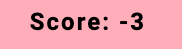

# Second Milestone Project: World Cup Rugby 2023 - Memory Card Game

## Introduction

This repository contains all the information and code for the website of World Cup Rugby 2023 Memory CardGame. This web-based game hosts a fun and simple mempry card game inspired by the excitment of the Rugby World Cup 2023. Whether you're a rugby enthusiast or a fan of memory card games, this project offers an engaging experirnce.

## About the Game

The World Cup Rugby Memory Card Game is designed to test your memory.The game fetaures a grid of cards each depciting rugby player captains participating in the Rugby World Cup 2023. Your goal is to flip the cards, revealing the players, and match pairs to score points. But mismatched cards come with a penalty.

## Table of Contents

- [Business-Goals](#business-goals)
- [5-Planes-of-UX](#5-planes-of-ux)
- [User-Stories](#user-stories)
- [Wireframes](#wireframes)
- [Features](#features)
- [Technology](#technology)
- [Testing](#testing)
- [Deployment](#deployment)
- [Credits](#credits)
- [References](#references)

## Business Goals

### Memory Card Game: World Cup Rugby 2023 website is designed to achieve the following business objectives:

- Engage rugby enthusiats and fans of the Rugby World Cup 2023 by providing an enjoyable and interactive gaming experience.
- Promote the Rugby World Cup by using the game as a fun and enducational tool.
- Enhance the brand visibility and recognition of the World Cup.
- Increase website traffic. Use the game as a traffic generator and increase user engagement.
- Community building among rugby fans by incorporating social sharing features and encouraging fans to connect with each other.

### Memory Card Game: World Cup Rugby 2023 aims to fulfill the following user goals:

- Entertainment for the user, offering a fun memory card game that can be enjoyed during leisure time.
- Educate users about teams and players in the rugby world cup.
- Competition where users can compete against one another.
- Create nostalgia and celebrate their favourite players from the rugby world cup.
- Stress relief and relaxation tool that can be enjoyed as a break in the day.
- Accessable to all ages and skill levels.
- Can help children with their cognitive, memory and concentration.
- Family friendly. Parents and children can engage playing the game.
- Help encourage sport to a new younger generation.

## 5 Planes of UX

To ensure a comprehensive and seamless user experience, this website focuses on the following five planes of UX:

**Strategy:** The game is strategically designed to align with the business goals of promoting the Rugby World Cup 2023 and engaging users effectively. It aims to educates users about the World Cup while providing entertainment. The game's design is user-centered, catering to both rugby enthusiasts and the younger generation new to the sport, ensuring that it resonates with the essence of the event.

**Scope:** The game's scope encompasses essential game features, player cards and game mechanics. It emphasizes simplicity and accessibility, ensuring that players of all ages can easily understand and enjoy the game.

**Structure:** The game's navigation and structure are intuitive, making it easy for users to access different sections and features. It employs a clear and consistent labeling to facilitate smooth gameplay, catering to both adult rugby fans and children.

**Skeleton:** The game's layout, typography, and visual elements are designed to create an appealing and harmonious interface. It uses responsive design to ensure the game adapts well to various devices and screen sizes.

**Surface:** The game utilizes captivating visuals, including player images and world cup logos. The color scheme, typography, and overall style align with the world cup's branding, creating a visually engaging and enjoyable gaming experience for users.

## User Stories

As a user of World Cup Rugby 2023 Memory Card Game:

- I want the game to be visually appealing and engaging, with clear instructions to guide me throughout my experience.
- I want to learn about some of the players and countries in the rugby world cup.
- I want to relax and have fun playing a game.
- As a new player, I want to see the current score displayed on the screen, so I can track my progress during the game.
- As a player, I want the ability to click on a "REMATCH" button, so I can start a new game after completing or ending a game.
- As a player, I want to click on a "RULES" button, so I can access the game rules and understand how to play.
- As a player, I want to be alerted when I win, lose or draw the game.
- As a player, I want to play the game on different devices and screen sizes, and I expect the game to be responsive and work well on both desktop and mobile.
- As a player, I want to have the option to start a new game at any time by clicking the "REMATCH" button, so I can restart without refreshing the page.
- I want to check and see if there any additions to the game.

## Wireframes

## Features

- Interactive card grid for play.

- Scoring system simulating rugby tries and penalties.

- Restart the game at any time with the "REMATCH" button.
- Rules button to open modal explaining the rules of the game.
- Score display

- Rules Modal for quick and easy understanding of the game.

- Alert system to notify you of the game results.

## Technology

- **Language:** HTML, CSS, Javascript
- **Google Fonts:** Roboto
- **Code Anywhere:** used a cloud code editor.
- **GitHub:** used as a cloud based code repository
- **Sweet Alert:** used for alerts to notify game results
- **Midjourney:** used for the grass background image

### Color used

- **Nav Bar:** light pink #ffb6c1
- **Heading and font:** Default black
- **Ovelay color for Modal:** Mid green #1caf4380

## Testing

- Both CSS and HTML code was validated and showed no signs of errors with W3C Markup validator and W3C CSS Validator.
- Javascript code was validated and showed no signs of error with JSHint tool.

## Manual Testing

### Functional Testing

| **Feature**                          | **Action**                                 | **Behaviour**                                               | **Result** |
| ------------------------------------ | ------------------------------------------ | ----------------------------------------------------------- | ---------- |
| Rules Button                         | click button                               | opens modal                                                 | pass       |
| Close modal                          | click close button                         | modal closes                                                | pass       |
| Rematch button                       | click rematch button                       | resets the game                                             | pass       |
| Two matching cards                   | click two matching playing cards           | 2 matching cards earn 7 points. Score display updates       | pass       |
| Two mismatched cards                 | click two playing cards                    | 2 mismatched cards results -3 points. Score display updates | pass       |
| Complete game with negative points   | Check game ends when all cards are matched | Alert: You Lose!                                            | Pass       |
| Complete game with one point or more | Check game ends when all cards are matched | Alert: You Win!                                             | Pass       |
| Complete game with 0 points          | Check game ends when all cards are matched | Alert: It's a draw!                                         | Pass       |

### UI/UX Testing:

| **Feature**           | **Action**                                   | **Behaviour**                                       | **Result** |
| --------------------- | -------------------------------------------- | --------------------------------------------------- | ---------- |
| Rematch Button        | Hover over button                            | Cursor chnages, button highlights red               | pass       |
| Rules Button          | Hover over button                            | Cursor chnages, button highlights red               | pass       |
| Modal overlay         | Click rules button                           | overlay prevents clicking cards                     | pass       |
| Card flipping         | click on cards                               | flip correctly and you can't double click same card | pass       |
| Matching cards        | click two matching cards                     | matching cards stay face up                         | pass       |
| Two mismatching cards | click two mismatching cards                  | cards flip back to original position                | pass       |
| Error handling        | Try to break the game, rapidly clip on cards | game handles such cases                             | pass       |

### Devices and Browsers Used for Testing

Mac Pro 2014

- Safari: Version 16.4.1
- Firefox: 118.0.2
- Chrome: Version 116.0.5845.96

Dell desktop

- Safari
- Firefox
- Chrome

Iphone 8

- Safari
- Firefox
- Chrome

### Known bugs

- Currently no known bugs.

## Deployment

### Setting up GitHub pages:

1. To add files to the repository take the following steps
1. In the command line type - git add .
   git commit -m "This is being committed" git push
1. To add all new files or modified file use " ." - To add a single file use the pathway to the file eg .index.html or assets/css/style.css When committing make sure your comments are clear about what changes have been made. Pushing will send your work to the repository
1. Any changes made and pushed to the main branch will automatically show up on the site.

### Making changes to the website:

First you need to sign-up to GitHub and Code Anywhere. To do this please see below.

#### Create a Code Anywhere account:

1. If you don't already have one, go to the Code Anywhere website https://codeanywhere.com/signup and create a new account.
2. Enter first and last name.
3. Enter Email
4. Enter new password

#### Create a GitHub account:

1. If you don't already have one, go to the GitHub website https://github.com/ and create a new account.
2. Click sign up
3. Enter email address
4. Enter username
5. Create password
6. Verify your account by solving the puzzles
7. Click create account
8. Verify your account in using your sign-up email

To access the code to this project there are two options: **Cloning** and **Forking**.

Cloning: code will be linked to your repo and any pushes you make will go to the original developer for approval.

#### Here is how to clone code:

1. On GitHub.com, navigate to the main page of the repository. You can find that [here](https://github.com/DomGambarini/first-milestone-project)
2. Above the list of files, click <> **Code**.
3. Copy the URL for the repository.
4. In a separate tab, open Code Anywhere
5. Create a new workspace
6. Type ' git clone ', and then paste the URL you copied earlier.
7. Press Enter to create your local clone.

Forking: refers to creating a personal copy of someone else's repository under your own GitHub account. This copy is stored in your account and allows you to freely experiment with and make changes to the code without affecting the original repository. If I make changes to the original repo you will be informed and have the option to pull.

#### Here is how to fork code:

1. Log in to your GitHub account and navigate to the repository you want to fork. You can find that [here](https://github.com/DomGambarini/first-milestone-project)
2. On the repository's page, click on the "Fork" button located at the top right corner of the page. This action creates a copy of the repository under your GitHub account.
3. GitHub will redirect you to the forked repository, which is now hosted under your account. You can identify it by the "forked from" message displayed at the top of the repository name.
4. At this point, you have successfully forked the repository, and you can start working with the code.

## Credits

**Code:**

- Code on how to create 3D effect with flip cards came from information from this site: [Flip card effect](https://www.youtube.com/watch?v=ZniVgo8U7ek)
- Code on how to create a modal came from information from this site: [Creating a modal](https://www.youtube.com/watch?v=MBaw_6cPmAw&t=613s)

## References

- Playing card images for top card and bottom card from [Rugby World Cup](https://www.rugbyworldcup.com/2023)
-
